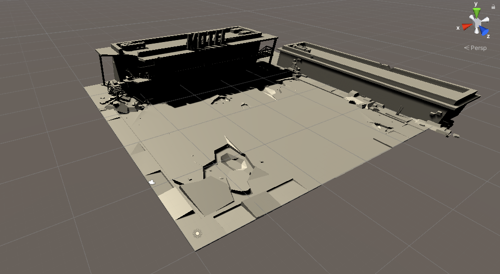
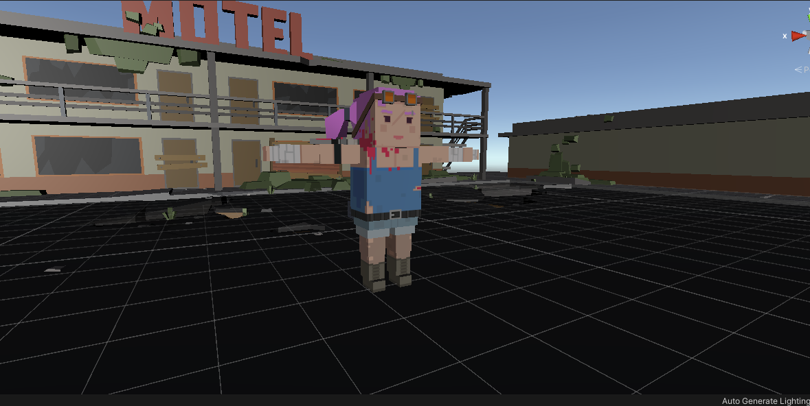

# Apocalipse Zumbi

Jogo que será desenvolvido durante a matéria de Motores de Jogos do de Desenvolvimento de Jogos do IFMA.

## Sobre

O jogo será desenvolvido usando o **Unity**.

## Algumas imagens do desenvolvimento

### Iniciando a criação da primeira cena

|  |
|-|
| *Primeira cena/fase do jogo sendo desenvolvida.* |

### Personagem adicionada ao jogo

|  |
|-|
| *Personagem: **Heroina*** |

### Primeira movimentação implementada

|  |
|-|
| *Movimentação da Personagem implementada* |

*Também foi adicionado cores no jogo, física e colisões.*
